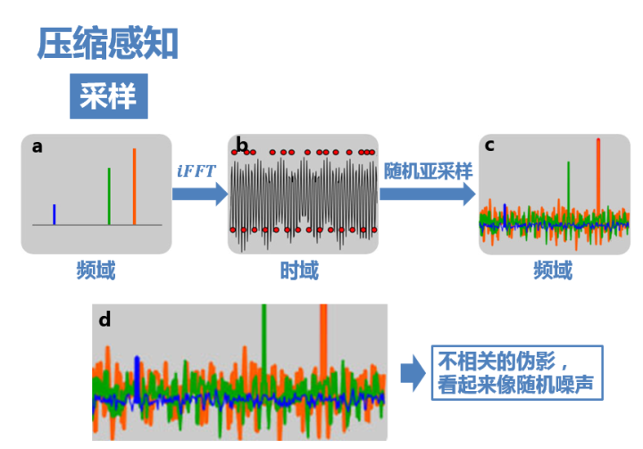
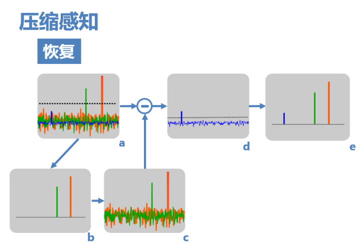
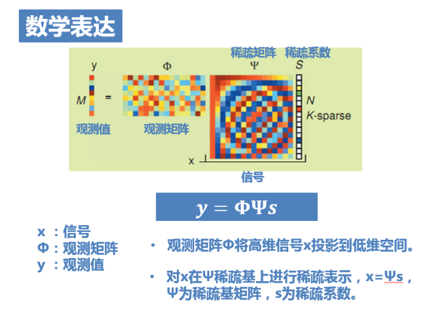

压缩感知简单介绍以及毫米波常用CS算法总结记录。
<!--more-->

## 概念
+ Nyquist采样定理：采样频率大于信号中最高频率的两倍时，采样后的数字信号完整的保留了原始信号中的信息。一般实际应用中保证采样频率为信号最高频率的2.56～4倍。
+ 对信号的时域采样即为对频域频谱的搬移，将频谱按照fs进行搬移。小于两倍采样率则会发生混叠。
+ 2004年，陶哲轩、Emmanuel Candes和David Donoho证明了：如果信号是稀疏的，name它可以由远低于采样定理要求的采样点重建恢复。关键在于不等间距采样。

如下图使用随机亚采样，频谱中会产生大量不相关的干扰值，但由于随机采样使得频谱随机的搬移，频谱泄漏均匀的分布在整个频域，因而泄漏值都比较小，有了恢复的可能。

恢复：有多种算法，如匹配追踪：
+ 通过阈值检测出较大的频率值;
+ 计算着两个非0值引起的干扰；
+ 去除计算出的干扰值，迭代计算其他频率值。

## 压缩感知的应用条件
1. 信号稀疏性（近似满足稀疏性）：对于CS，只要信号在某一个变换域满足近似稀疏特性即可，重建将在稀疏域进行；
2. 不相关性：观测矩阵和稀疏表示基不相关（与RIP条件等价）。

数学表达：

观测值y：随机亚采样得到的信号；
观测矩阵（测量矩阵）$\Phi$ :即随机亚采样矩阵；
信号x：原始信号（不一定稀疏，因此需要稀疏矩阵进行变换）；
稀疏矩阵$\Psi$:稀疏基，将原始信号变换为稀疏信号s。

CS即在已知$\Phi$、$\Psi$、y的基础上求解x。

$\Theta = \Phi \Psi$称为感知矩阵，$y=\Theta s$是一个欠定方程

独立同部分的高斯测量矩阵可以成为普适的压缩感知测量矩阵。

由于方程没有封闭解，因此没办法直接求出方程的解，而根据信号的稀疏性，我们可以用最稀疏的解来代替原始稀疏信号（有损压缩）。
压缩感知重建方法是一个零范数最小化问题，是一个NP完全问题，往往转换为1范数最小化的求解。

## 常用压缩感知算法
>凸松弛方法：基于范数最小化的优化方法。最典型的是基追踪算法。

1. 基追踪方法（BP）
原问题：
$$ \tilde{s} = \arg \min \left \\| \hat{s} \right \\| \_ 0 \quad \mbox{s.t.} \quad \Theta \hat{s}=y$$
转换为1范数求解问题：
$$ \tilde{s} = \arg \min \left \\| \hat{s} \right \\| \_ 1 \quad \mbox{s.t.} \quad \Theta \hat{s}=y$$
在噪声情况下，可以表示为：
$$ \tilde{s} = \arg \min \left \\| \hat{s} \right \\| \_ 1 \quad \mbox{s.t.} \quad \left \\| \Theta \hat{s}-y \right \\|_2 \leq \sigma$$
其中有$y=\Theta s+n$ 以及 $\left \\|n \right \\|_2<\sigma$

2. 改进的基追踪算法(I-BP)
使用1范数约束：
$$ \tilde{s} = \arg \min \left \\| \hat{s} \right \\| \_ 1 \quad \mbox{s.t.} \quad \left \\| \Theta \hat{s}-y \right \\|_1 \leq \sigma$$

>贪婪算法，主要思想为在每次迭代过程中选择一个最能估计原始信号的原子。主要包括匹配追踪算法(MP)、正交匹配追踪算法(OMP)、子空间追踪(SP)、压缩采样匹配追踪算法(CoSaMP)、正则化正交追踪算法(ROMP)、稀疏自适应匹配追踪算法(SAMP)和正则化自适应匹配追踪算法(RAMP).

3. 匹配追踪算法(MP)
思想：对于稀疏信号s，观测向量y的结果只与s中非零系数对应的观测矩阵列向量有关。即只有这些列和y最匹配。
每次迭代时，MP法将这些最匹配的列存入匹配矩阵。每次迭代都可以分为两步：原子选择和更新残差。
流程：
input: 归一化字典D（观测矩阵$\Theta$），观测信号y，稀疏度K
(1) 初始化残差$r_0=y$，x全0；
(2) 第k步，从字典中选择$d_i = \max_{j}<d_j,r_k>$；
(3) 计算残差$r_{k+1}=r_k-d_i<r_k,d_i>$，以及信号$x_i=<r_k,d_i>$，$d_i$加入匹配矩阵；
(4) 迭代计算(2)(3)步直到残差满足终止条件(稀疏度达到K或者其他)。
MP算法各列向量并不是正交的，因此迭代之间会产生干扰，算法效率不高，逼近结果较差。

4. 正交匹配追踪算法(OMP)
针对MP算法的缺点，OMP算法每次迭代中，将新选出的列向量正交投影在已经选出的向量上，然后进行更新残差的运算。
即每次根据新加入的原子所得到的新的匹配矩阵重新计算整个稀疏向量x；
可以加快算法收敛速度。

5. 子空间追踪算法(SP)

>待更新......

## 毫米波通信中压缩感知应用

