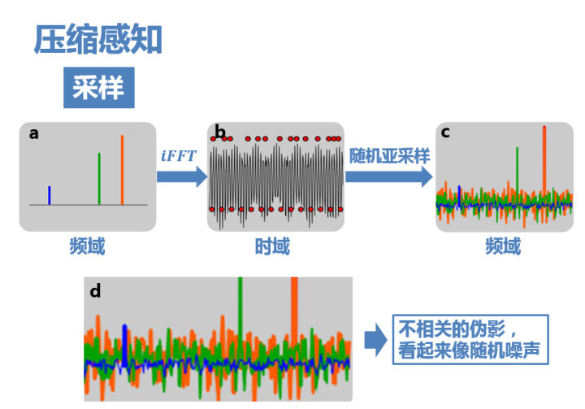
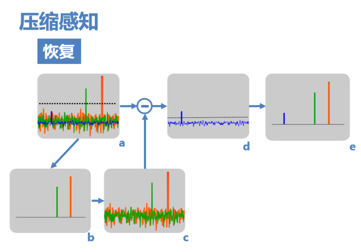
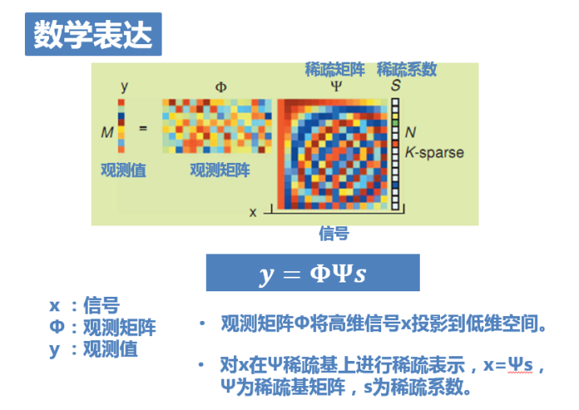

压缩感知简单介绍以及毫米波常用CS算法总结记录。
<!--more-->

# 压缩感知
### 概念
+ Nyquist采样定理：采样频率大于信号中最高频率的两倍时，采样后的数字信号完整的保留了原始信号中的信息。一般实际应用中保证采样频率为信号最高频率的2.56～4倍。
+ 对信号的时域采样即为对频域频谱的搬移，将频谱按照fs进行搬移。小于两倍采样率则会发生混叠。
+ 2004年，陶哲轩、Emmanuel Candes和David Donoho证明了：如果信号是稀疏的，name它可以由远低于采样定理要求的采样点重建恢复。关键在于不等间距采样。

如下图使用随机亚采样，频谱中会产生大量不相关的干扰值，但由于随机采样使得频谱随机的搬移，频谱泄漏均匀的分布在整个频域，因而泄漏值都比较小，有了恢复的可能。

恢复：有多种算法，如匹配追踪：
+ 通过阈值检测出较大的频率值;
+ 计算着两个非0值引起的干扰；
+ 去除计算出的干扰值，迭代计算其他频率值。

### 压缩感知的应用条件
1. 信号稀疏性（近似满足稀疏性）：对于CS，只要信号在某一个变换域满足近似稀疏特性即可，重建将在稀疏域进行；
2. 不相关性：观测矩阵和稀疏表示基不相关（与RIP条件等价）。

数学表达：

观测值y：随机亚采样得到的信号；
观测矩阵$\Phi$ :即随机亚采样矩阵；
信号x：原始信号（不一定稀疏，因此需要稀疏矩阵进行变换）；
稀疏矩阵$\Psi$:稀疏基，将原始信号变换为稀疏信号。

CS即在已知$\Phi$、$\Psi$、y的基础上求解x。

独立同部分的高斯测量矩阵可以成为普适的压缩感知测量矩阵。

压缩感知重建方法是一个零范数最小化问题，是一个NP完全问题，往往转换为1范数最小化的求解。

### 毫米波中常用压缩感知算法总结
