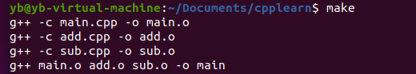

linux下c++编程，makefile编写方式。

<!--more-->

### 简单makefile文件示例
```makefile
	helloworld:file1.o file2.o
		g++ file1.o file2.o -o helloworld
		
	file2.o:file2.cpp
		g++ -c file2.cpp -o file2.o
		
	file1.o:file1.cpp
		g++ -c file1.cpp -o file1.o
		
	clean:
		rm -rf *.o helloworld
```

规则：
```rule
	A: B
		<command>
		<command>
```
冒号表示依赖关系。写好makefile文件后，之间键入make命令，就会执行内容了。


### 变量使用
```variable
	OBJS = file1.o file2.o
	XX = g++
	CFLAGS = -Wall -O -g
	
	hellowordl : $(OBJS)
		$(XX) $(OBJS) -o helloworld
		
	file2.o : file2.cpp file1.h
		$(XX) $(CFLAGS) --c file2.cpp -o file2.o
	
	file1.o : file1.cpp file1.h
		$(XX) $(CFLAGS) --c file1.cpp -o file2.o
	
	clean:
		rm -rf *.o helloworld
```


### 函数使用
```function
	CC = gee
	XX = g++
	CFLAGS = -Wall -O -g
	TARGET = helloworld

	%.o : %.c
		$(CC) $(CFLAGS) -e $< - o $@
		
	%.o : %.cpp
		$(XX) $(CFLAGS) -e $< -o $@
		
	SOURCES = $(wildeard *.c *.cpp)
	OBJS = $(patsubst %.c,%.o , $(patsubst %.cpp,%.o, $(SOURCES)))
	
	$(TARGET) : $(OBJS)
		$(XX) $(OBJS) -o $(TARGET)
	
	clean :
		rm -rf * .o helloworld
```
+ 第7行中，`$<`拓展成依靠列表中的第一个依靠文件，`$^`拓展成依靠列表中所有文件（去除重复），`$@`拓展成当前规则的目的文件名。
+ 在 makefile 规则中，通配符会被自动展开 。 但在变量的定义和函数引用时，通配符将失效。
+ `$(wildcard *.c *.cpp)`函数，展开为已经存在的、使用空格分开的、匹配此模式的所有文件列表。
+ `$(patsubst %.c,%.o,$(dir))`函数三个参数，第一个是一个需要匹配的式样，第二个参数表示用什么来替换，第三个是需要处理的由空格分隔的列表。


