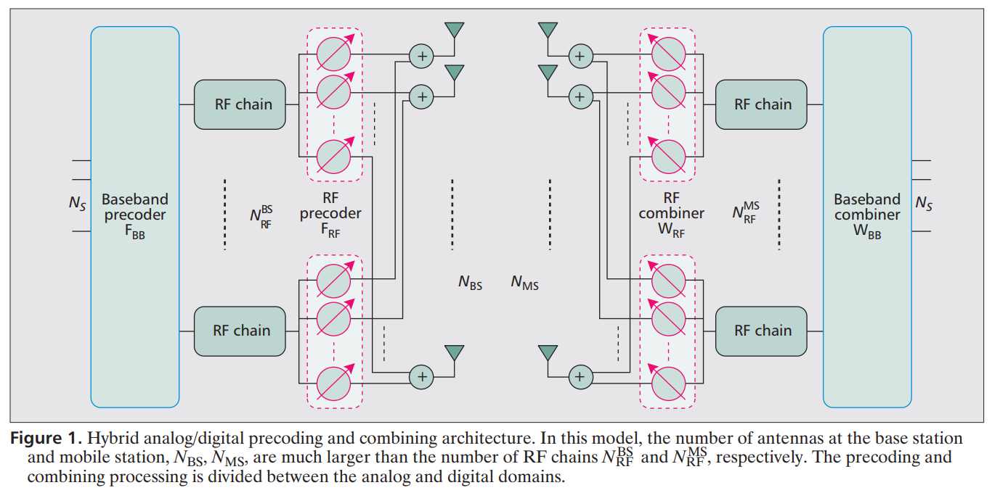

介绍beamforming，主要是毫米波beamforming结构。

<!--more-->

## beamforming作用
模拟波束赋形：调整天线波束相位幅度以获得增益；
数字波束赋形：通过SVD分解等进行预编码来获得增益。

一般将ABF称为波束赋形，需要小天线间距，利用空间信道的强相关性和波的干涉原理产生强方向性的辐射方向图；
DBF称为预编码，基站侧使用大间距的多跟天线阵列，有基于码本的和无码本的两种方式。

## 低频段
对于sub-6G频段，一般使用MIMO天线系统，且天线数较少，可以通过信道估计获得信道矩阵H。
接收信号为：
$$y={\bf H}s+n$$
对信道矩阵H进行SVD分解得到：
$$\bf H=U \Sigma V^{*}$$
因此选择precoder矩阵$U^{*}$和combiner矩阵$V$，可以得到：
$${\bf U}^{*}y {\bf V} = {\bf \Sigma} s + {\bf U}^{*}n $$
得到等效信道，解码出对应的发送信号。实现吞吐量的最大化。

有基于码本和无码本两种方式。

缺点：量化精度导致性能损失；

无码本：BS基于上行信道估计下行信道信息；根据SVD分解获得需要的预编码矩阵。
>优点：避免量化精度的损失；
缺点：CSI的获取以及信道互易性的利用具有实时性；反馈开销增大。

## 毫米波频段
特点：
1. 硬件约束：由于毫米波波长很短，可以采用massive MIMO，即使用更多的天线；高精度ADCs导致高功耗，因此很难为每个天线配备一个RF chain；
2. 计算复杂度：由于massive MIMO导致信道矩阵维度很高，因此信道估计、预编码等计算复杂度大大提高；
3. 稀疏性：毫米波传输特性导致信道矩阵比较稀疏（有用的径比较少，且以直视径为主）。

基于上述特点，毫米波频段下提出两种传输结构：混合预编码(HBF)、低精度ADCs（1比特）。

### 混合预编码
对于DBF，每个天线都需要一个RF chain，但是可以支持多流传输；对于ABF，只需要一个RF chain，然后通过相移器改变，但是只支持单流传输。
ABF：包括扇区级扫码、beam refinement、波束追踪等阶段。但是受相移器量化精度和幅度的限制。

提出混合波束赋形(hybrid beamforming):

如上图结构，可以得到接收信号为：
$$ \bf y = W_{BB}^{*} W_{RF}^{*} H F_{RF} F_{BB} s + W_{BB}^{*} W_{RF}^{*} n $$

### 1 bit ADC
>略  可参考 A. Alkhateeb, J. Mo, N. Gonzalez-Prelcic and R. W. Heath, "MIMO Precoding and Combining Solutions for Millimeter-Wave Systems," in IEEE Communications Magazine, vol. 52, no. 12, pp. 122-131, December 2014.

