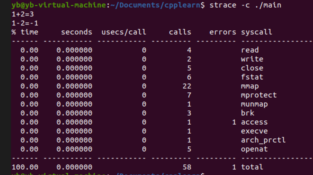
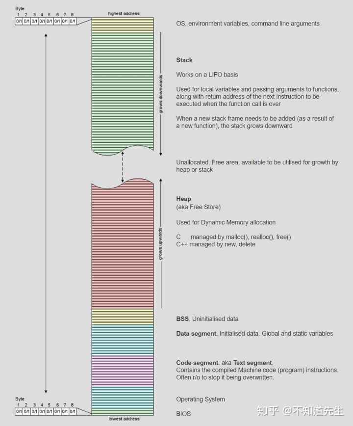

linux下几个调试工具及其使用。
<!--more-->

### strace
跟踪系统调用。用法：`strace ./test`
得到的信息中每一行都是一个系统调用，等号左边是系统调用的函数名及其参数，右边是该调用的返回值。
`strace -c ./test`统计系统调用，结果如下：

其他参数：
+ `-o filename`将结果输入到文件中（与`2>filename`作用一样，其中`2>`为错误重定向符号，将写入`stderr`的信息写入`filename`中）；
+ `-T`打印出每个系统调用花费的时间；
+ `-p pid`跟踪现有的进程pid；

### gdb
#### 调试c++程序
gdb是gcc的调试工具，主要用于C和c++这两种语言编写的程序。
功能：
+ 断点
+ 检查运行状态
+ 动态改变程序的执行环境

一些用法：
+ 编译时加上`-g`参数：`g++ -g hello.cpp -o hello`；
+ 启动gdb：`gdb program`或者直接打开gdb然后输入`file program`（file一定要有，加上`-q`参数可以消除介绍文字）；
+ `list`或者`l`列出程序，一次10行，可以加上参数如`list 5 10`、`list test.c 5 10`、`list 5`、`list func`；
+ `b 6`或者`break 6`在第6行设置断点，返回断点编号和内存位置；`break func`给函数func设置断点；`info break`查看断点信息；以条件表达式设置断点`break 7 if n==5`；
+ `disable 3`使第3个断点失效，`enable 3`恢复；`clear 6`删除第6行的断点；`delete 6`删除第6个断点；
+ `run`或者`r`运行程序；
+ continue，程序暂停时继续运行程序的命令；
+ print 变量名或表达式，打印该变量或者该表达式的值。whatis 变量名或者表达式，可以显示该变量或表达式的数据类型；
+ print 变量=值，这种形式还可以给对应的变量赋值；
+ next，继续执行下一条语句；还有一条命令step，与之类似，不同的是，当下一条语句遇到函数调用的时候，next不会跟踪进入函数，而是继续执行下面的语句，而step命令则会跟踪进入函数内部；
+ quit 退出调试；kill 结束当前程序的调试，不会跳出gdb。
>以上命令全部可以用第一个字母代替。

### 分析coredump文件
coredump文件时进程终止时的现场数据（内存、CPU寄存器、各种函数调用堆栈信息等）。
>gdb还可以分析coredump文件，等涉及到再添加......

### top
显示系统当前的进程和其他状况。输入`q`退出。

### ps
列出当前运行的进程。
常用参数如下图：

### Valgrind
内存分析工具。由一系列工具组成：

程序内存空间：代码段、初始化数据段、未初始化数据段、堆、栈，具体如下：

+ 使用 leak-chech可以检查内存泄漏，想要具体定位在程序哪个位置存在泄漏，编译时加上 -g参数即可。

使用memcheck可以检查很多内存问题......

